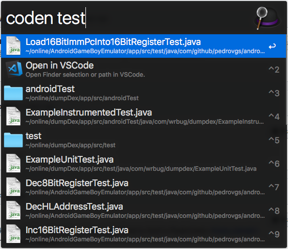
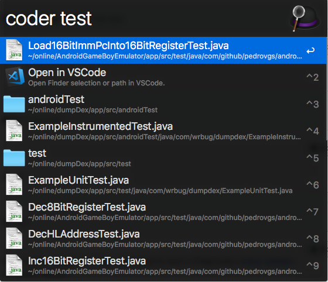
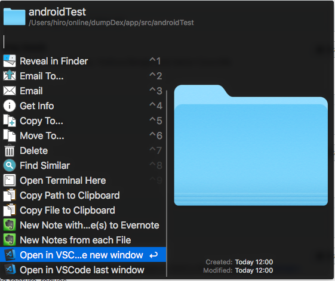

# Open In VSCode For Alfred Workflow

## 安装方法 (中文):

* 启动 VS Code.
* 打开 **VSCode命令行** (⇧⌘P)，然后输入 'shell command' 找到 **Shell Command: Install 'code' command in PATH** 这一项，回车.

ref: https://code.visualstudio.com/docs/setup/mac

## Installation (Origin):

* Launch VS Code.
* Open the **Command Palette** (⇧⌘P) and type 'shell command' to find the **Shell Command: Install 'code' command in PATH** command.

ref: https://code.visualstudio.com/docs/setup/mac

## 使用方法：

1. `coder` 命令会在启动最后一个活跃的 VSCode 窗口打开指定文件或文件夹

2. `coden` 命令会在启动新的 VSCode 窗口打开指定文件或文件夹

3. 文件操作

## 参考文档

https://code.visualstudio.com/docs/editor/command-line
